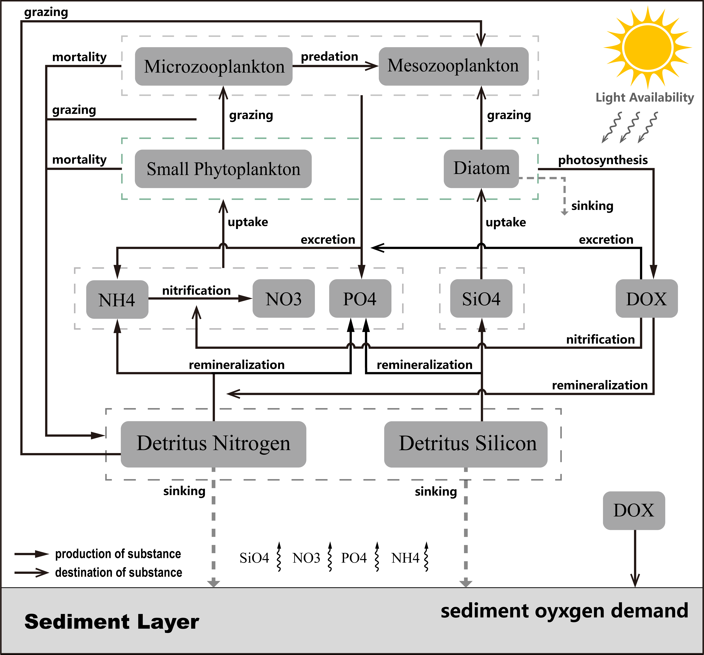

# 1D_Ecosystem_Model_for_LO_paper

This one-dimensional (1D) ecosystem model is developed primarily based on the [CoSiNE module](https://ccrm.vims.edu/schismweb/CoSiNE_manual_ZG_v5.pdf) of SCHISM modeling system. It is designed to simulate the high-frequency dynamics of bottom dissolved oxygen, as part of Wu et al. (2024.)

Wu et al. (2024). High-frequency dynamics of bottom dissolved oxygen in temperate shelf seas: the joint role of tidal mixing and sediment oxygen demand, *Limnol. Oceanogr.* Under Review.

**CoSiNE_1D_main.m**: the core code of the ecosystem model.

**CoSiNE_1D_demo.m**: the demo used to demonstrate the usage of model.

**cosine.nml**: namelist file of the model configuration.

This model contains a total of 11 state variables, including two phytoplankton species (small phytoplankton and diatom), two zooplankton species (microzooplankton and mesozooplankton), four dissolved inorganic nutrients (nitrate, phosphate,ammonium, and silicate), two detritus organic matters (detritus nitrogen and detritus silicon), and dissolved oxygen (see Figure 1 below). 

**Figure 1.** Model framework

Author Info: Wenfan Wu, PhD, Virginia Institute of Marine Science, William & Mary | [wwu@vims.edu](mailto:wwu@vims.edu)
